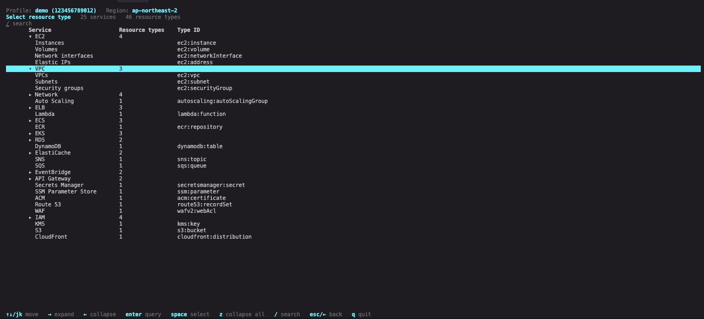
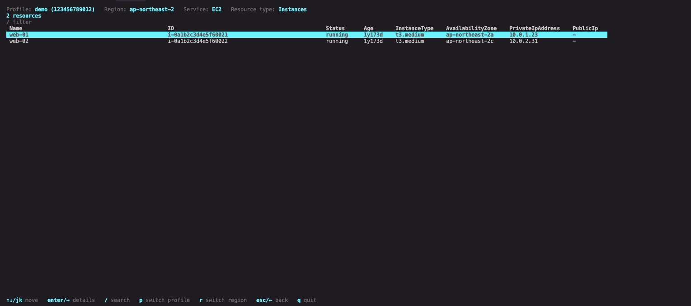
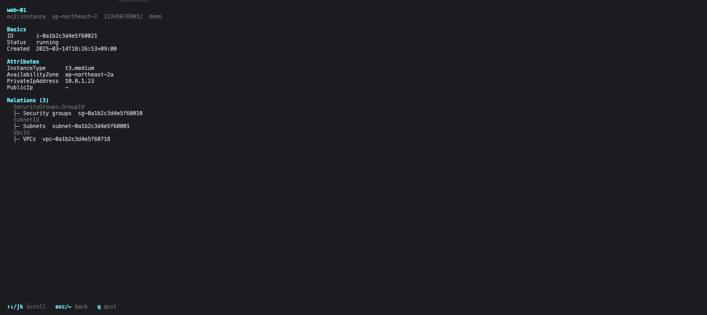

<h1 align="center">cloudloupe</h1>

<p align="center">
  <em>A read-only AWS infrastructure investigation TUI — inspect resources and their relationships across profiles.</em>
</p>

<p align="center">
  <a href="https://github.com/cnlgks1/cloudloupe/releases"></a>
  <a href="LICENSE"></a>
  
</p>

`~/.aws/config`의 프로필을 읽어 여러 프로필·리전의 AWS 리소스를 조회하는 터미널 UI입니다.
리소스를 만들거나 바꾸지 않습니다.

지원하는 리소스와 필드는 릴리스마다 계속 늘어납니다.

<p align="center">
  
</p>

> 화면은 모두 `cloudloupe --demo`로 만든 가짜 데이터입니다. 실제 계정 정보가 아닙니다.

## 빠른 시작

```sh
git clone https://github.com/cnlgks1/cloudloupe.git
cd cloudloupe
make build
./cloudloupe
```

프로필 → 계정 확인(STS) → 리전 → 리소스 → 조회 순으로 진행합니다.

## 화면

조회 결과는 컬럼 정렬 테이블로 보여줍니다. 상태·타입·IP 같은 속성을 세로로 훑어 비교하기 좋습니다.



상세 화면은 그 리소스가 맺은 관계를 함께 보여줍니다. 관계 이름은 그 연결을 만든 SDK 응답 필드
경로라 `aws` CLI 출력과 대조할 수 있습니다.



AWS 계정이 없어도 `cloudloupe --demo`로 이 화면들을 그대로 체험할 수 있습니다.

## 조회 전용

- SDK 호출은 allow-list로 제한합니다. `Describe`, `List`, `Get`, `Lookup`, `Search`,
  `BatchGet` 접두사만 허용하고, 그 외 호출이 있으면 `make verify-readonly`가 실패합니다.
- 수집기 인터페이스에는 `Type`과 `Collect`만 있습니다. 쓰기 경로가 없습니다.
- 설정 파일은 읽기만 합니다. 수정하거나 외부로 전송하지 않습니다.
- 조회 결과를 로컬 파일로 저장하지 않습니다. 화면에만 보여줍니다.

권한이 부족해도 전체가 죽지 않습니다. 읽을 수 없는 리전이나 타입은 오류로 보고되고 나머지는
정상 수집됩니다.

## 지원 리소스

EC2, VPC, ELB, Lambda, ECS, EKS, RDS, IAM, S3 등 20여 개 서비스의 리소스를 조회합니다.
서비스·타입 ID·SDK API 전체 목록과 필드 표기 규칙은 [docs/resources.md](docs/resources.md)에
있습니다. 지원 범위는 릴리스마다 늘어납니다.

Secrets Manager 시크릿과 SSM 파라미터는 메타데이터만 조회하고, `GetSecretValue`·`GetParameter`
같은 값 읽기 API는 호출하지 않습니다.

## 사용법

```sh
cloudloupe                                    # 대화형 TUI
cloudloupe --demo                             # AWS 없이 가짜 데이터로 체험
cloudloupe --check                            # 설정 위치·권한 진단 (문제 시 exit != 0)
cloudloupe --list-profiles [--output json]    # TUI 없이 프로필 목록
cloudloupe --ascii                            # 유니코드 미지원 터미널용 ASCII 테마
cloudloupe --config PATH --credentials PATH
```

| 키 | 동작 |
| --- | --- |
| `↑↓` `j` `k` | 이동 |
| `enter` `→` | 다음 단계 · 조회 · 상세 |
| `space` | 여러 개 선택 |
| `esc` `←` | 뒤로 (수집 중에는 취소) |
| `/` `t` `e` | 검색 · 종류 필터 · 부분 오류 보기 |
| `p` `r` | 프로필 · 리전 전환 |
| `q` `ctrl+c` | 종료 |

경로는 실행할 때마다 해석하며 우선순위는 AWS CLI와 같습니다(`AWS_CONFIG_FILE` →
`~/.aws/config`). `--config`, `--credentials`와 TUI 입력 경로는 프로필 탐색, STS 확인, 실제
조회에 동일하게 적용됩니다. 터미널이 아니거나 파이프로 넘기면 목록 출력으로 자동 폴백합니다.

## IAM 권한

읽기 권한만 필요합니다. 관리형 `ReadOnlyAccess`면 충분합니다. 더 좁게 가려면
[`examples/iam/cloudloupe-readonly-policy.json`](examples/iam/cloudloupe-readonly-policy.json)을
출발점으로 줄이세요. 이 예제는 아직 쓰지 않는 CloudWatch·CloudTrail·태그 API까지 포함하므로
현재 호출 기준의 최소 권한은 아닙니다.

## 설치

```sh
# Homebrew (macOS, Linux)
brew install cnlgks1/tap/cloudloupe

# macOS, Linux, WSL: OS·CPU 자동 감지, SHA-256 검증, ~/.local/bin에 설치
curl -fsSL https://raw.githubusercontent.com/cnlgks1/cloudloupe/main/install.sh | sh

# Go 도구 체인
go install github.com/cnlgks1/cloudloupe/cmd/cloudloupe@latest

# 소스에서 직접 빌드
git clone https://github.com/cnlgks1/cloudloupe.git && cd cloudloupe && make build
```

Windows는 [Releases](https://github.com/cnlgks1/cloudloupe/releases)에서 zip과
`checksums.txt`를 받아 `Get-FileHash -Algorithm SHA256`으로 검증한 뒤 PATH에 둡니다.

macOS, Linux, Windows × amd64, arm64 6종을 `CGO_ENABLED=0` 정적 바이너리로 빌드합니다.
유니코드 박스 문자를 못 그리는 터미널은 자동 감지해 ASCII로 폴백하며 `--ascii` 또는
`CLOUDLOUPE_ASCII=1`로 강제할 수 있습니다.

## 소스 구조

```text
cmd/cloudloupe            플래그, 입출력, TUI 실행
internal/app              프로필·리전별 AWS 설정과 수집 실행 조립
internal/catalog          타입 ID·표시명·범위·목록 열·수집기 생성의 단일 출처
internal/collect          AWS SDK를 모르는 Collector/Registry/Runner 코어
internal/collector/<svc>  서비스별 조회와 SDK → model 변환
internal/demo             --demo용 가짜 데이터 (AWS 없이 체험)
internal/graph            ID·ARN·DNS 관계 해석과 정방향·역방향 인덱스
internal/model            외부 의존성이 없는 도메인 모델
internal/tui              Bubble Tea 상태 전이와 렌더링
```

## 개발

```sh
make ci         # gofmt 검사, vet, 조회 전용 가드, 테스트, 빌드, 6종 크로스 컴파일
make test       # 단위 테스트
make lint       # golangci-lint
make test-race  # 데이터 레이스 검사
make cross      # 6종 OS/아키텍처 빌드
make help       # 전체 타깃
```

`make ci`는 커밋 전 로컬 검사이며 GitHub Actions 행렬과 동일하지 않습니다. 크로스 컴파일은
로컬이 훨씬 싸므로(빌드 캐시가 있으면 몇 초) CI는 태그와 수동 실행에서만 돌립니다. 릴리스는
GoReleaser가 6종을 다시 빌드하고 하나라도 실패하면 게시하지 않습니다.

## 문서

| 문서 | 내용 |
| --- | --- |
| [docs/resources.md](docs/resources.md) | 지원 서비스·타입·SDK API 전체 목록과 필드·관계 규칙 |
| [docs/go-conventions.md](docs/go-conventions.md) | 설계 규칙 |
| [CONTRIBUTING.md](CONTRIBUTING.md) | 기여 절차 |
| [RELEASING.md](RELEASING.md) | 릴리스 운영 |
| [SECURITY.md](SECURITY.md) | 취약점 신고 |

## 라이선스

[MIT](LICENSE)
